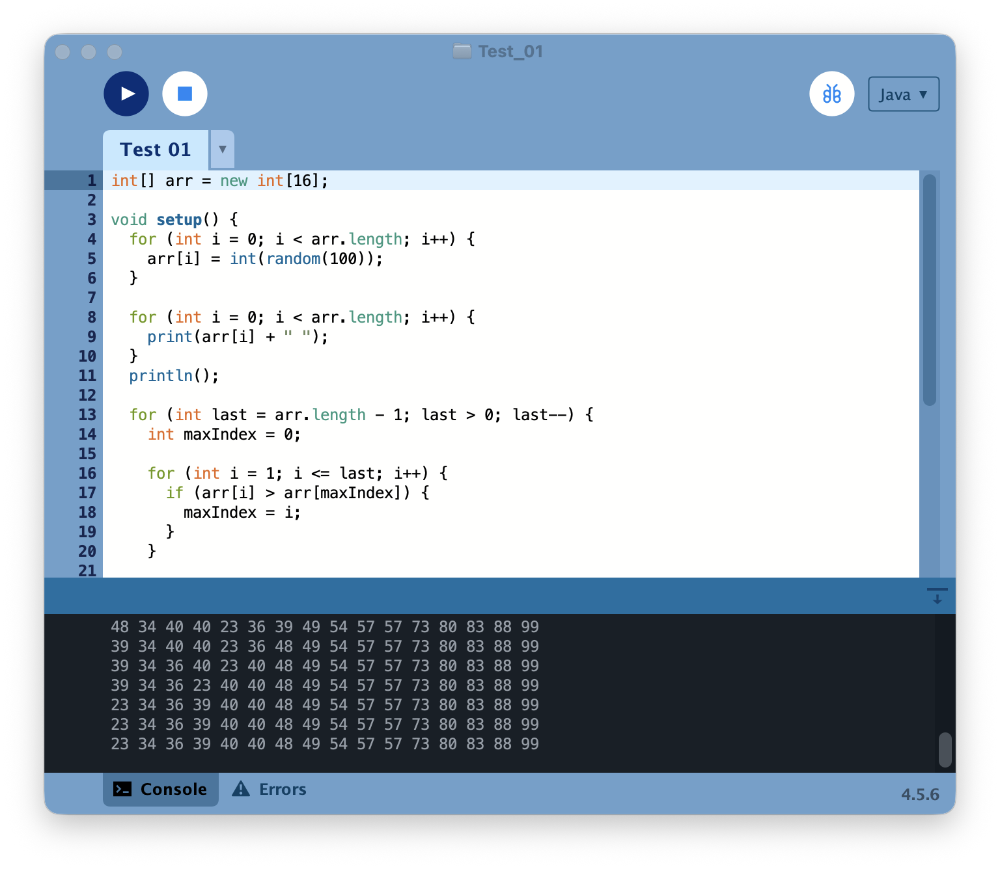
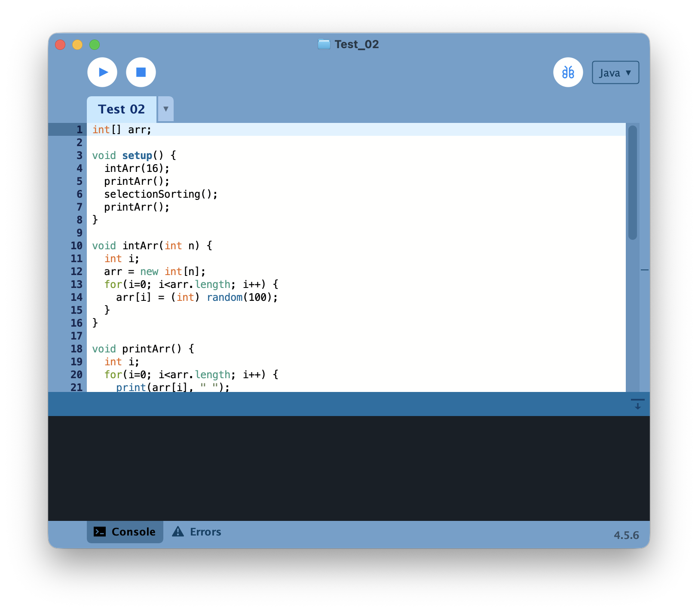
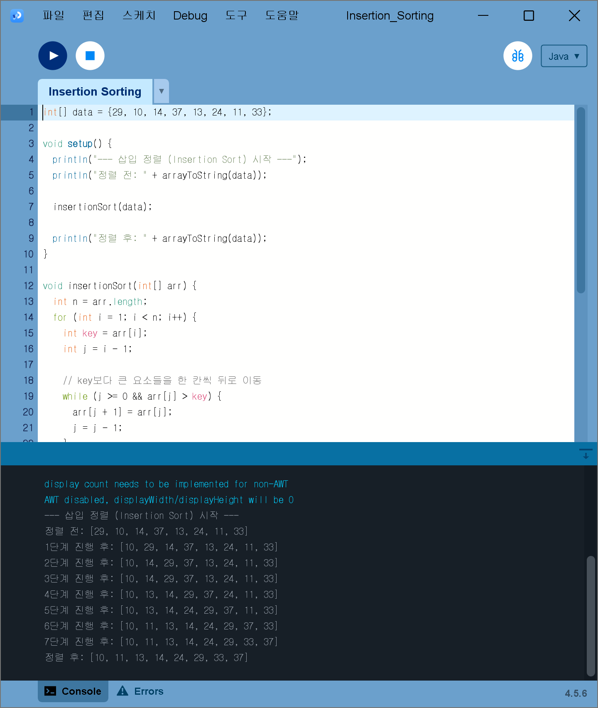
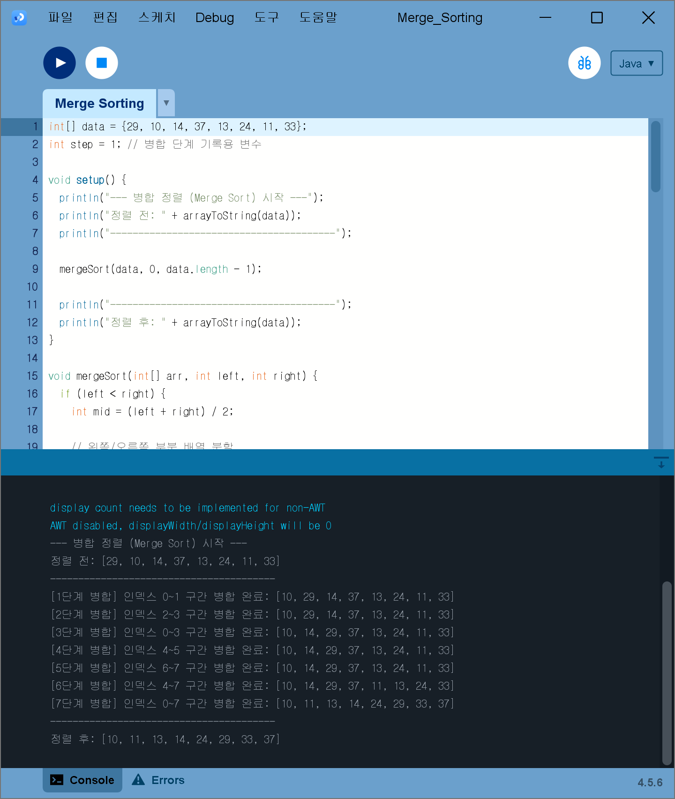
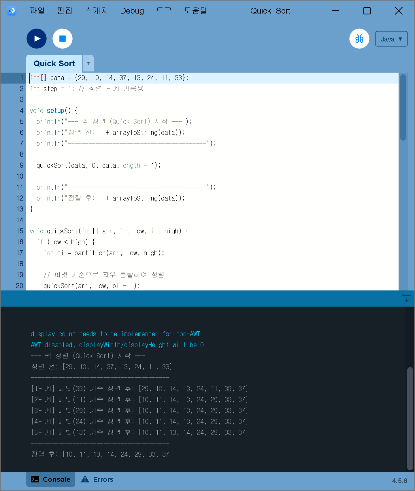

# Algorithm2026
고급알고리즘 강의

### Homework1

[SelectionSorting](./homework/SelectionSorting/SelectionSorting.pde)

### Homework2

[BubbleSort](./homework/BubbleSort/BubbleSort.pde)

### Homework3

[InsertionSorting](./homework/InsertionSorting/InsertionSorting.pde)

### Homework4

[MergeSorting](./homework/MergeSorting/MergeSorting.pde)

### Homework5

[QuickSort](./homework/QuickSort/QuickSort.pde)

